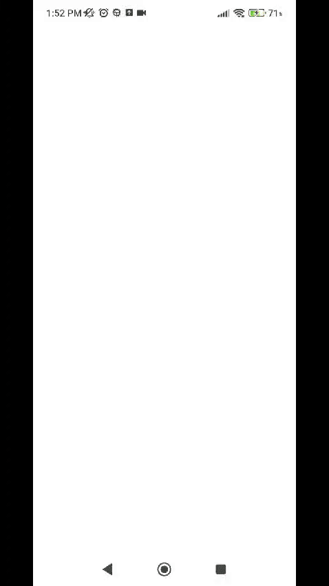
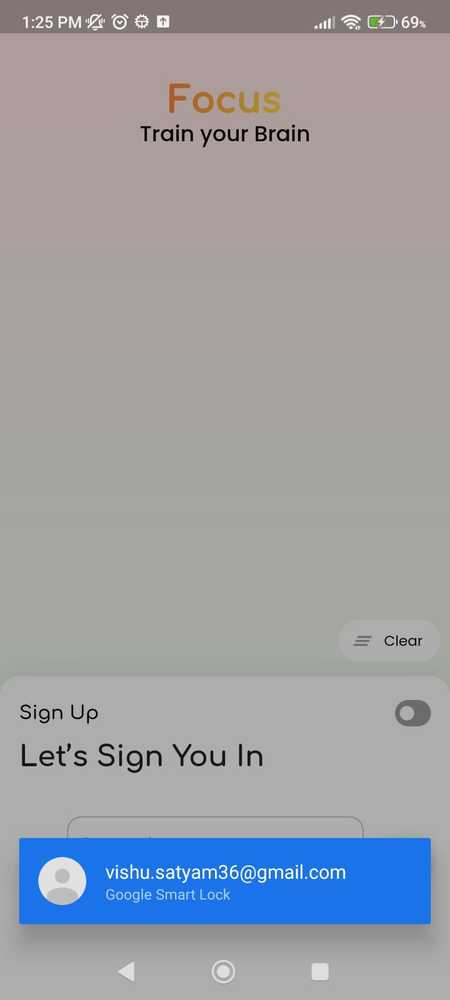

# Flutter based MCQ Question Answer

## Download
[APK](https://docs.flutter.dev/get-started/codelab)
### Quick Demo

### Login Page

 

 

### Home Page

 

 

## Core Concepts

- Cache user activity
- Paginated Questions Fetch
- Timer based approach for showing countdown of next question
- Performant rebuilds using provider selector and child system from [Provider](https://pub.dev/packages/provider)
- Use of firebase transaction to have data consistency
- BottomNav with GoRouter
- SmartAuth for saving user credentials
- LottieAnimations for feedback to user

## Database

## Getting Started

This project is a starting point for a Flutter application.

A few resources to get you started if this is your first Flutter project:

- [Lab: Write your first Flutter app](https://docs.flutter.dev/get-started/codelab)
- [Cookbook: Useful Flutter samples](https://docs.flutter.dev/cookbook)

For help getting started with Flutter development, view the
[online documentation](https://docs.flutter.dev/), which offers tutorials,
samples, guidance on mobile development, and a full API reference.
